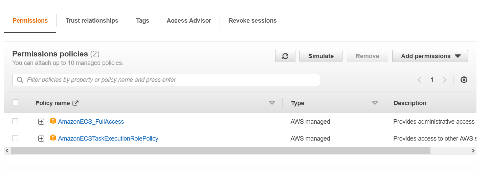

## Jenkins JCasC Configuration

### Prerequisites :

Create a password directory which will have all the credentials in the files like this

This directory is update in the docker compose file like this

- #### Pre-requisite for EC2 Slave
    - The ssh key should be passed into jenkins master through `password` directory and in `docker-compose` as `agent-key` in above image
    - Jenkins Slave EC2 should have `java` installed. It can be done using `yum install java-openjdk -y`

- #### Pre-requisite for ECS Slave 
    - First we have to create an IAM Role so that EC2 Jenkins master can access the ECS so for it I created a IAM Role with `ECSFullAccess` and `TaskExecution` like this.

    

    - The task execution role is used by ECS to execute the task which the master will assign it.

    - Also important part in this IAM Role is the **Trust Relationship** segment. In this segment we define what are the trusted entities for this role than can use `AWS STS` to `assumerole`. 

    - Thus here we add `EC2` , `ECS` and `ECS-Task` as trusted entities like this.

    

    - We also need to pre create a ECS Cluster whose ARN will be referenced in the Jenkins CasC file like this. 

    

    - One more thing we require is to create `Log Group` in the AWS CloudWatch for the ECS Agent Cluster with the same name as referenced in Jenkins CacC file.

    

